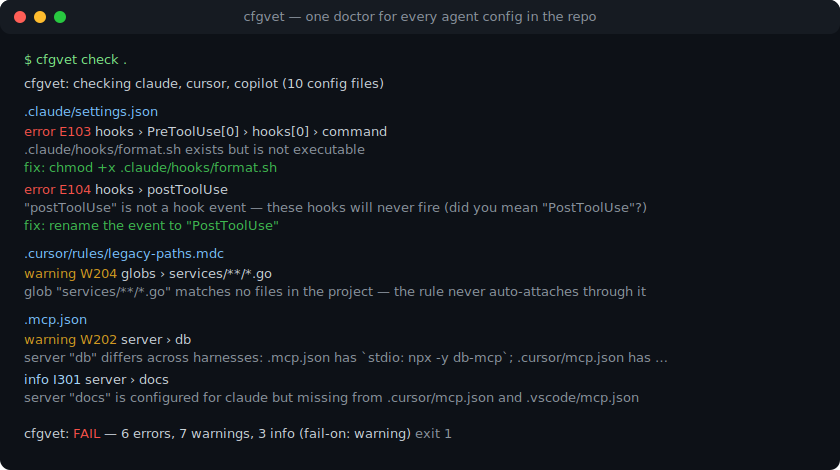
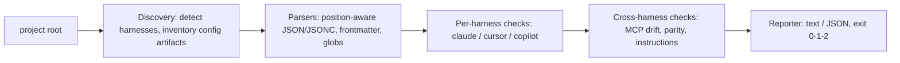

# cfgvet

[English](README.md) | [中文](README.zh.md) | [日本語](README.ja.md)

[](LICENSE)   [](CONTRIBUTING.md)

**`.claude`・`.cursor`・Copilot の設定ディレクトリを診るオープンソースのドクター——スキーマ検証、実行ビット、宙に浮いた参照、ツール間ドリフトを、オフラインの 1 コマンドで。**



```bash
# not yet on npm — install from a checkout of this repository
npm install && npm run build && npm pack
npm install -g ./cfgvet-0.1.0.tgz
```

## なぜ cfgvet？

エージェント設定はいつの間にか本物のコードベースになりました。hooks、権限ルール、スラッシュコマンド、agents、skills、Cursor ルール、Copilot 指示、そして 3 方言の `mcp.json` が `.claude/`・`.cursor/`・`.github/`・`.vscode/` に散らばっています。どれもコンパイルされず、lint もされず、失敗はすべて無音です——実行ビットを失ったスクリプトを指す hook はただ二度と動かず、`postToolUse` というタイポは永遠に発火しないイベントになり、リファクタを生き延びたルールの glob は何にもマッチせず、同僚が `.cursor/mcp.json` だけ更新して `.mcp.json` を忘れた MCP サーバーは、同じ名前で別のバックエンドに繋がる 2 人を生みます。今日これらのディレクトリを読む linter は存在しません。スキーマ駆動のエディタはスキーマを持つ単一ファイルしか知らず、各ベンダーのツールは自分の harness で手を止めます。cfgvet は 3 つの設定面を 1 つの単位として読みます——harness が実際に受け付ける形に対して構造を検証し、参照先ファイルの存在と実行ビットを stat し、すべての glob を実際のツリーで評価し、MCP 定義を harness 間で突き合わせ、パイプラインがそのままゲートにできる終了コードを返します。

|  | cfgvet | IDE JSON schemas | `claude doctor` | 汎用 linter |
|---|---|---|---|---|
| `.claude` + `.cursor` + Copilot を一体として読む | ○ | ✕——一度に 1 ファイル | ✕——Claude Code 専用 | ✕——これらのパスは見えない |
| 宙に浮いた参照（hook スクリプト、`@file`、MCP コマンド） | ○、ファイルシステムを stat | ✕ | ✕ | ✕ |
| hook スクリプトの実行ビットと shebang | ○ | ✕ | ✕ | ✕ |
| 実ツリーで検出する死んだ glob（`globs:`、`applyTo:`） | ○ | ✕ | ✕ | ✕ |
| harness 間の MCP ドリフトとパリティ | ○ | ✕ | ✕ | ✕ |
| 動く場所 | ターミナルと CI、完全オフライン | エディタ内 | Claude Code 内 | CI（ただしここは盲点） |
| ランタイム依存 | 0 | 対象外 | 対象外 | 数十個 |

<sub>各ツールの能力は公開ドキュメントに照らして確認、2026-07。</sub>

## 特長

- **harness が実際に受け付ける形で検証**——hook イベント語彙、matcher グループの入れ子、権限ルール構文、`env` 値の型、MCP エントリの形。タイポには候補提示付き（`postToolUse` → `PostToolUse`）。
- **すべての参照を stat**——hook コマンド、`statusLine`、`.mdc` の `@file` 行、MCP `command` パスを（`$CLAUDE_PROJECT_DIR` 込みで）解決し、存在・実行ビット・shebang を確認。解決できない `$VARS` はスキップし、決して推測しません。
- **glob を実ツリーで評価**——Cursor の `globs:` や Copilot の `applyTo:` が 1 ファイルにもマッチしなければ死んだルールとして指摘。走査では `.git` や `node_modules` などを除外。
- **リポジトリを 1 つの設定面として扱う**——同名 MCP サーバーが harness ごとに別バックエンドを指す（W202）、片側にしかないサーバー（I301）、指示ファイルのパリティ欠落（I302）を第一級の診断に。
- **すべての診断に修正案**——安定コード付きの 25 ルール（E1xx/W2xx/I3xx）、どれも具体的な直し方付き。`cfgvet explain <code>` が全ルールをオフラインで解説。
- **CI のために、依存ゼロ**——決定的な出力、`--format json`、`--fail-on error|warning|info|never`、終了コード 0/1/2。必要なのは Node.js だけで、ソケットは一切開きません。

## クイックスタート

インストール：

```bash
# not yet on npm — install from a checkout of this repository
npm install && npm run build && npm pack
npm install -g ./cfgvet-0.1.0.tgz
```

プロジェクトを検査（同梱の `examples/broken`——Claude Code・Cursor・VS Code を併用するリポジトリ）：

```bash
cfgvet check examples/broken
```

出力（実際の実行結果、16 件中 5 件を抜粋）：

```text
cfgvet: checking claude, cursor, copilot (10 config files)

.claude/settings.json
  error E103 hooks › PreToolUse[0] › hooks[0] › command
      .claude/hooks/format.sh exists but is not executable
      fix: chmod +x .claude/hooks/format.sh
  error E104 hooks › postToolUse
      "postToolUse" is not a hook event — these hooks will never fire (did you mean "PostToolUse"?)
      fix: rename the event to "PostToolUse"

.cursor/rules/legacy-paths.mdc
  warning W204 globs › services/**/*.go
      glob "services/**/*.go" matches no files in the project — the rule never auto-attaches through it
      fix: update the pattern to the current tree layout, or remove it

.mcp.json
  warning W202 server › db
      server "db" differs across harnesses: .mcp.json has `stdio: npx -y db-mcp`; .cursor/mcp.json has `stdio: npx -y db-mcp@2`; .vscode/mcp.json has `stdio: npx -y db-mcp`
      fix: align the definitions so every tool talks to the same backend
  info I301 server › docs
      server "docs" is configured for claude but missing from .cursor/mcp.json and .vscode/mcp.json
      fix: add it to the missing files if every tool should see it

cfgvet: FAIL — 6 errors, 7 warnings, 3 info (fail-on: warning)
```

終了コード 1——そのまま CI に置けます。修正済みの双子 `examples/clean` は診断ゼロで 0 終了。採点せずに検出物だけ見たいなら `cfgvet list` が harness 別の一覧を表示し、`cfgvet explain E103` はどのルールもオフラインで解説します。さらに多くのシナリオ（仕込んだ欠陥の全一覧、CI ゲートスクリプト）は [examples/](examples/README.md) に。

## ルール

エラー（E1xx）は今まさに壊れているもの。警告（W2xx）は harness が黙って無視・誤処理するもの。情報（I3xx）は知っておくべきツール間ドリフト。コードは安定 API で、番号の振り直しはしません。以下はハイライトで、根拠付きの全カタログは [docs/rules.md](docs/rules.md)、harness 別のファイル一覧は [docs/harnesses.md](docs/harnesses.md) に。

| ルール | 深刻度 | 指摘内容 |
|---|---|---|
| E101 | error | 設定ファイルが正しい JSON でない（行・列を特定。JSONC は `.vscode/mcp.json` のみ許可） |
| E102 | error | 参照先ファイルが存在しない——hook スクリプト、`@file` 行、MCP コマンド |
| E103 / W209 | error / warning | hook スクリプトが実行不可 / 実行可能だが shebang 欠落 |
| E104 / E105 | error | 未知の hook イベント（候補提示） / hook エントリの構造不正 |
| E106 / E107 / E108 | error | MCP サーバーエントリ不正 / skill 破損 / frontmatter 破損 |
| E109 / E110 | error | permissions ブロック不正 / `env` 値が文字列でない |
| W201 / W207 | warning | 未知の設定キー（候補提示） / 永遠にマッチしない権限ルール |
| W202 | warning | 同名 MCP サーバーが harness ごとに別バックエンド |
| W203 / W205 | warning | レガシー `.cursorrules` / 起動経路のないルール |
| W204 | warning | 1 ファイルにもマッチしない `globs:` / `applyTo:` パターン |
| W208 / W210 / W212 | warning | マシン固有の絶対パス / ローカル設定が gitignore されていない / JSON 重複キー |
| I301 / I302 / I303 | info | MCP サーバーが片方の harness のみ / 指示パリティの欠落 / ローカルによる共有設定の上書き |

## CLI リファレンス

`cfgvet check [dir]` が既定のサブコマンド。`cfgvet list [dir]` は設定の一覧を表示し、`cfgvet explain <topic>` はルールコード・`codes`・`exit-codes` を解説します。

| フラグ | 既定値 | 効果 |
|---|---|---|
| `--fail-on <level>` | `warning` | `error`・`warning`・`info` 以上で 1 終了。`never` は常に 0 終了 |
| `--format text\|json` | `text` | レポート形式。JSON は CI 向けの安定した構造 |
| `--harness <list>` | 検出された全部 | `claude,cursor,copilot` のカンマ区切り部分集合に検査を限定 |
| `-q, --quiet` | オフ | ヘッダ行と判定行のみ |

終了コード：`0` は `--fail-on` 以上の診断なし、`1` は診断あり、`2` は使い方・入力エラー——パイプラインは壊れた設定と壊れた呼び出しを区別できます。

## アーキテクチャ



## ロードマップ

- [x] 3 harness の検出、25 ルールカタログ、実行ビット・宙に浮いた参照の検査、harness 間 MCP ドリフト/パリティ、`list` + `explain` サブコマンド、JSON 出力（v0.1.0）
- [ ] `--fix`：機械的に直せる修正（chmod、gitignore 追記、キー改名）をその場で適用
- [ ] ユーザーレベル設定（`~/.claude`、Cursor グローバルルール）とプロジェクト上書きのマージ表示
- [ ] さらなる harness：Windsurf ルール、Zed アシスタント設定、`AGENTS.md` 規約
- [ ] watch モード：変更のたびに再診断し、リグレッションを持ち込まれた瞬間に可視化

全リストは [open issues](https://github.com/JaydenCJ/cfgvet/issues) を参照。

## コントリビュート

貢献を歓迎します。`npm install && npm run build` でビルドし、`npm test`（90 テスト）と `bash scripts/smoke.sh`（`SMOKE OK` の出力必須）を実行してください——このリポジトリに CI はなく、上記の主張はすべてローカル実行で検証されています。[CONTRIBUTING.md](CONTRIBUTING.md) を読み、[good first issue](https://github.com/JaydenCJ/cfgvet/issues?q=is%3Aissue+is%3Aopen+label%3A%22good+first+issue%22) を掴むか、[discussion](https://github.com/JaydenCJ/cfgvet/discussions) を始めましょう。

## ライセンス

[MIT](LICENSE)
