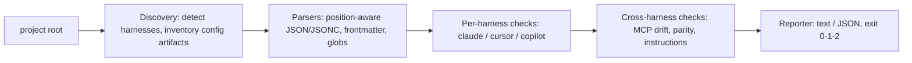

# cfgvet

[English](README.md) | [中文](README.zh.md) | [日本語](README.ja.md)

[](LICENSE)   [](CONTRIBUTING.md)

**An open-source doctor for `.claude`, `.cursor` and Copilot config directories — schema validation, exec bits, dangling references and cross-harness drift in one offline command.**


```bash
# not yet on npm — install from a checkout of this repository
npm install && npm run build && npm pack
npm install -g ./cfgvet-0.1.0.tgz
```

## Why cfgvet?

Agent configuration has quietly become a real codebase: hooks, permission rules, slash commands, agents, skills, Cursor rules, Copilot instructions and three different `mcp.json` dialects, spread across `.claude/`, `.cursor/`, `.github/` and `.vscode/`. None of it is compiled, none of it is linted, and every failure is silent — a hook whose script lost its exec bit simply never runs, a `postToolUse` typo is an event that never fires, a rule glob that survived a refactor attaches to nothing, and the MCP server your teammate updated in `.cursor/mcp.json` but not `.mcp.json` means two people now talk to different backends under the same name. No linter reads these directories today: schema-based editors only know single files they have a schema for, and each vendor's own tooling stops at its own harness. cfgvet reads all three surfaces as one unit — it validates structure against what the harnesses actually accept, stats the referenced files for existence and exec bits, evaluates every glob against the real tree, compares MCP definitions across harnesses, and returns exit codes a pipeline can gate on.

|  | cfgvet | IDE JSON schemas | `claude doctor` | generic linters |
|---|---|---|---|---|
| Reads `.claude` + `.cursor` + Copilot as a unit | yes | no — one file at a time | no — Claude Code only | no — these paths are invisible to them |
| Dangling references (hook scripts, `@file`, MCP commands) | yes, stats the filesystem | no | no | no |
| Exec bits and shebangs on hook scripts | yes | no | no | no |
| Dead globs (`globs:`, `applyTo:`) against the real tree | yes | no | no | no |
| Cross-harness MCP drift and parity | yes | no | no | no |
| Where it runs | your terminal and CI, fully offline | inside the editor | inside Claude Code | CI, but blind here |
| Runtime dependencies | 0 | n/a | n/a | dozens |

<sub>Capability notes checked against each tool's public documentation, 2026-07.</sub>

## Features

- **Validates what the harnesses actually accept** — hook event vocabulary, matcher-group nesting, permission rule syntax, `env` value types, MCP entry shapes; typos get a did-you-mean (`postToolUse` → `PostToolUse`).
- **Stats every reference** — hook commands, `statusLine`, `.mdc` `@file` lines and MCP `command` paths are resolved (`$CLAUDE_PROJECT_DIR` included) and checked for existence, exec bits and shebangs; unresolvable `$VARS` are skipped, never guessed at.
- **Evaluates globs against the real tree** — a Cursor `globs:` or Copilot `applyTo:` pattern that matches zero files is a dead rule and gets flagged, with `.git`, `node_modules` and friends excluded from the walk.
- **Treats the repo as one config surface** — the same MCP server name resolving to different backends per harness (W202), servers missing on one side (I301), and instruction parity gaps (I302) are first-class findings.
- **A fix on every finding** — 25 stable-coded rules (E1xx/W2xx/I3xx), each with a concrete remediation; `cfgvet explain <code>` documents every rule offline.
- **Built for CI, zero dependencies** — deterministic output, `--format json`, `--fail-on error|warning|info|never`, exit codes 0/1/2; Node.js is the only requirement and the tool never opens a socket.

## Quickstart

Install:

```bash
# not yet on npm — install from a checkout of this repository
npm install && npm run build && npm pack
npm install -g ./cfgvet-0.1.0.tgz
```

Check a project (the bundled `examples/broken` — a repo using Claude Code, Cursor and VS Code side by side):

```bash
cfgvet check examples/broken
```

Output (real captured run, abridged to 5 of the 16 findings):

```text
cfgvet: checking claude, cursor, copilot (10 config files)

.claude/settings.json
  error E103 hooks › PreToolUse[0] › hooks[0] › command
      .claude/hooks/format.sh exists but is not executable
      fix: chmod +x .claude/hooks/format.sh
  error E104 hooks › postToolUse
      "postToolUse" is not a hook event — these hooks will never fire (did you mean "PostToolUse"?)
      fix: rename the event to "PostToolUse"

.cursor/rules/legacy-paths.mdc
  warning W204 globs › services/**/*.go
      glob "services/**/*.go" matches no files in the project — the rule never auto-attaches through it
      fix: update the pattern to the current tree layout, or remove it

.mcp.json
  warning W202 server › db
      server "db" differs across harnesses: .mcp.json has `stdio: npx -y db-mcp`; .cursor/mcp.json has `stdio: npx -y db-mcp@2`; .vscode/mcp.json has `stdio: npx -y db-mcp`
      fix: align the definitions so every tool talks to the same backend
  info I301 server › docs
      server "docs" is configured for claude but missing from .cursor/mcp.json and .vscode/mcp.json
      fix: add it to the missing files if every tool should see it

cfgvet: FAIL — 6 errors, 7 warnings, 3 info (fail-on: warning)
```

Exit code 1 — drop it into CI as-is. The fixed twin `examples/clean` exits 0 with zero findings. To see what cfgvet found without grading it, `cfgvet list` prints the per-harness inventory, and `cfgvet explain E103` documents any rule offline. More scenarios (the full seeded-defect table, a CI gate script) live in [examples/](examples/README.md).

## Rules

Errors (E1xx) mean something is broken right now; warnings (W2xx) mean the harness silently ignores or mishandles something; info (I3xx) surfaces cross-harness drift worth knowing about. Codes are stable API, never renumbered. Highlights below; the full catalog with rationale is in [docs/rules.md](docs/rules.md), and the per-harness file inventory in [docs/harnesses.md](docs/harnesses.md).

| Rule | Severity | Flags |
|---|---|---|
| E101 | error | config file is not valid JSON (exact line/column; JSONC allowed only in `.vscode/mcp.json`) |
| E102 | error | referenced file does not exist — hook script, `@file` line, MCP command |
| E103 / W209 | error / warning | hook script not executable / executable but missing its shebang |
| E104 / E105 | error | unknown hook event (did-you-mean) / malformed hook entry |
| E106 / E107 / E108 | error | malformed MCP server entry / broken skill / broken frontmatter |
| E109 / E110 | error | malformed permissions block / non-string `env` value |
| W201 / W207 | warning | unknown settings key (did-you-mean) / permission rule that can never match |
| W202 | warning | same MCP server name, different backend, across harnesses |
| W203 / W205 | warning | legacy `.cursorrules` / rule with no activation path |
| W204 | warning | `globs:` or `applyTo:` pattern matching zero files |
| W208 / W210 / W212 | warning | machine-specific absolute path / local settings not gitignored / duplicate JSON key |
| I301 / I302 / I303 | info | MCP server on one harness only / instructions parity gap / local override |

## CLI reference

`cfgvet check [dir]` is the default subcommand; `cfgvet list [dir]` prints the config inventory; `cfgvet explain <topic>` documents any rule code, `codes`, or `exit-codes`.

| Flag | Default | Effect |
|---|---|---|
| `--fail-on <level>` | `warning` | exit 1 at or above `error`, `warning`, `info`; `never` always exits 0 |
| `--format text\|json` | `text` | report format; JSON is a stable shape for CI |
| `--harness <list>` | all detected | restrict checks to a comma-separated subset of `claude,cursor,copilot` |
| `-q, --quiet` | off | header and verdict lines only |

Exit codes: `0` no findings at/above `--fail-on`, `1` findings, `2` usage or input error — so a pipeline can tell a broken config from a broken invocation.

## Architecture



## Roadmap

- [x] Three-harness discovery, 25-rule catalog, exec-bit and dangling-reference checks, cross-harness MCP drift/parity, `list` + `explain` subcommands, JSON output (v0.1.0)
- [ ] `--fix`: apply the mechanical remediations (chmod, gitignore entry, key renames) in place
- [ ] User-level config (`~/.claude`, Cursor global rules) with project overrides shown as a merged view
- [ ] More harnesses: Windsurf rules, Zed assistant config, `AGENTS.md` conventions
- [ ] Watch mode: re-vet on change and surface regressions as they are introduced

See the [open issues](https://github.com/JaydenCJ/cfgvet/issues) for the full list.

## Contributing

Contributions are welcome. Build with `npm install && npm run build`, then run `npm test` (90 tests) and `bash scripts/smoke.sh` (must print `SMOKE OK`) — this repository ships no CI, every claim above is verified by local runs. See [CONTRIBUTING.md](CONTRIBUTING.md), grab a [good first issue](https://github.com/JaydenCJ/cfgvet/issues?q=is%3Aissue+is%3Aopen+label%3A%22good+first+issue%22), or start a [discussion](https://github.com/JaydenCJ/cfgvet/discussions).

## License

[MIT](LICENSE)
