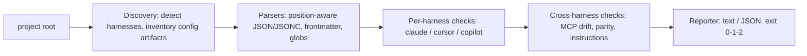

# cfgvet

[English](README.md) | [中文](README.zh.md) | [日本語](README.ja.md)

[](LICENSE)   [](CONTRIBUTING.md)

**一款开源的 `.claude`、`.cursor` 与 Copilot 配置目录体检工具——schema 校验、可执行位、悬空引用与跨工具漂移，一条离线命令全部搞定。**


```bash
# not yet on npm — install from a checkout of this repository
npm install && npm run build && npm pack
npm install -g ./cfgvet-0.1.0.tgz
```

## 为什么选 cfgvet？

智能体配置早已悄悄长成了一个真正的代码库：hooks、权限规则、斜杠命令、agents、skills、Cursor 规则、Copilot 指令，再加上三种方言的 `mcp.json`，散落在 `.claude/`、`.cursor/`、`.github/` 和 `.vscode/` 之间。这些内容不经编译、无人 lint，而且每一次失败都是无声的——脚本丢了可执行位的 hook 只是永远不再运行，`postToolUse` 这个拼写错误成了一个永不触发的事件，重构后幸存的规则 glob 再也匹配不到任何文件，而队友只更新了 `.cursor/mcp.json`、忘了 `.mcp.json` 的那个 MCP 服务器，意味着两个人正在用同一个名字连接不同的后端。今天没有任何 linter 会读这些目录：基于 schema 的编辑器只认识有 schema 的单个文件，各家厂商自己的工具也只管自己的 harness。cfgvet 把三套配置面当作一个整体来读——按 harness 真正接受的形式校验结构，对被引用的文件做存在性与可执行位检查，拿真实目录树验证每一个 glob，跨 harness 比对 MCP 定义，并返回流水线可以直接把关的退出码。

|  | cfgvet | IDE JSON schemas | `claude doctor` | 通用 linter |
|---|---|---|---|---|
| 把 `.claude` + `.cursor` + Copilot 当作整体读取 | 是 | 否——一次只看一个文件 | 否——只管 Claude Code | 否——这些路径对它们不可见 |
| 悬空引用（hook 脚本、`@file`、MCP 命令） | 是，直接 stat 文件系统 | 否 | 否 | 否 |
| hook 脚本的可执行位与 shebang | 是 | 否 | 否 | 否 |
| 用真实目录树验证死 glob（`globs:`、`applyTo:`） | 是 | 否 | 否 | 否 |
| 跨 harness 的 MCP 漂移与一致性 | 是 | 否 | 否 | 否 |
| 运行位置 | 终端与 CI，完全离线 | 编辑器内部 | Claude Code 内部 | CI，但对此一无所知 |
| 运行时依赖 | 0 | 不适用 | 不适用 | 数十个 |

<sub>各工具能力说明核对自其公开文档，2026-07。</sub>

## 功能特性

- **按 harness 真正接受的形式校验**——hook 事件词表、matcher 分组嵌套、权限规则语法、`env` 值类型、MCP 条目形状；拼写错误附带"你是不是想写"提示（`postToolUse` → `PostToolUse`）。
- **对每个引用做 stat**——hook 命令、`statusLine`、`.mdc` 的 `@file` 行和 MCP `command` 路径都会被解析（含 `$CLAUDE_PROJECT_DIR`）并检查存在性、可执行位与 shebang；无法解析的 `$VARS` 直接跳过，绝不瞎猜。
- **拿真实目录树验证 glob**——Cursor 的 `globs:` 或 Copilot 的 `applyTo:` 匹配不到任何文件就是一条死规则，会被标记；遍历时排除 `.git`、`node_modules` 等目录。
- **把仓库当作一个配置面**——同一个 MCP 服务器名在不同 harness 指向不同后端（W202）、只配了一边的服务器（I301）、指令覆盖不齐（I302），都是一等公民的诊断项。
- **每条诊断都带修复方案**——25 条稳定编码的规则（E1xx/W2xx/I3xx），条条附具体整改；`cfgvet explain <code>` 离线解释每一条规则。
- **为 CI 而生、零依赖**——输出确定性、`--format json`、`--fail-on error|warning|info|never`、退出码 0/1/2；唯一要求是 Node.js，工具从不打开任何 socket。

## 快速上手

安装：

```bash
# not yet on npm — install from a checkout of this repository
npm install && npm run build && npm pack
npm install -g ./cfgvet-0.1.0.tgz
```

检查一个项目（内置的 `examples/broken`——一个同时使用 Claude Code、Cursor 和 VS Code 的仓库）：

```bash
cfgvet check examples/broken
```

输出（真实运行记录，16 条诊断节选 5 条）：

```text
cfgvet: checking claude, cursor, copilot (10 config files)

.claude/settings.json
  error E103 hooks › PreToolUse[0] › hooks[0] › command
      .claude/hooks/format.sh exists but is not executable
      fix: chmod +x .claude/hooks/format.sh
  error E104 hooks › postToolUse
      "postToolUse" is not a hook event — these hooks will never fire (did you mean "PostToolUse"?)
      fix: rename the event to "PostToolUse"

.cursor/rules/legacy-paths.mdc
  warning W204 globs › services/**/*.go
      glob "services/**/*.go" matches no files in the project — the rule never auto-attaches through it
      fix: update the pattern to the current tree layout, or remove it

.mcp.json
  warning W202 server › db
      server "db" differs across harnesses: .mcp.json has `stdio: npx -y db-mcp`; .cursor/mcp.json has `stdio: npx -y db-mcp@2`; .vscode/mcp.json has `stdio: npx -y db-mcp`
      fix: align the definitions so every tool talks to the same backend
  info I301 server › docs
      server "docs" is configured for claude but missing from .cursor/mcp.json and .vscode/mcp.json
      fix: add it to the missing files if every tool should see it

cfgvet: FAIL — 6 errors, 7 warnings, 3 info (fail-on: warning)
```

退出码 1——原样放进 CI 即可。修好的孪生项目 `examples/clean` 以零诊断退出 0。想只看 cfgvet 发现了什么而不打分，`cfgvet list` 会打印按 harness 分组的清单，`cfgvet explain E103` 可离线解释任何规则。更多场景（完整的植入缺陷表、CI 把关脚本）见 [examples/](examples/README.md)。

## 规则

错误（E1xx）表示此刻就有东西坏了；警告（W2xx）表示 harness 会静默忽略或误处理某些内容；信息（I3xx）呈现值得了解的跨工具漂移。编码是稳定 API，永不重新编号。以下为要点；含理由的完整目录见 [docs/rules.md](docs/rules.md)，按 harness 的文件清单见 [docs/harnesses.md](docs/harnesses.md)。

| 规则 | 严重级 | 标记内容 |
|---|---|---|
| E101 | error | 配置文件不是合法 JSON（精确到行列；仅 `.vscode/mcp.json` 允许 JSONC） |
| E102 | error | 引用的文件不存在——hook 脚本、`@file` 行、MCP 命令 |
| E103 / W209 | error / warning | hook 脚本不可执行 / 可执行但缺 shebang |
| E104 / E105 | error | 未知 hook 事件（附提示） / hook 条目结构错误 |
| E106 / E107 / E108 | error | MCP 服务器条目错误 / skill 损坏 / frontmatter 损坏 |
| E109 / E110 | error | permissions 块结构错误 / `env` 值不是字符串 |
| W201 / W207 | warning | 未知设置键（附提示） / 永远匹配不到的权限规则 |
| W202 | warning | 同名 MCP 服务器在不同 harness 指向不同后端 |
| W203 / W205 | warning | 遗留 `.cursorrules` / 没有任何激活路径的规则 |
| W204 | warning | 匹配不到任何文件的 `globs:` 或 `applyTo:` 模式 |
| W208 / W210 / W212 | warning | 机器特有的绝对路径 / 本地设置未被 gitignore / JSON 重复键 |
| I301 / I302 / I303 | info | MCP 服务器只配了一个 harness / 指令覆盖不齐 / 本地覆盖共享设置 |

## CLI 参考

`cfgvet check [dir]` 是默认子命令；`cfgvet list [dir]` 打印配置清单；`cfgvet explain <topic>` 解释任意规则编码、`codes` 或 `exit-codes`。

| 参数 | 默认值 | 作用 |
|---|---|---|
| `--fail-on <level>` | `warning` | 达到 `error`、`warning`、`info` 即退出 1；`never` 恒退出 0 |
| `--format text\|json` | `text` | 报告格式；JSON 为 CI 提供稳定结构 |
| `--harness <list>` | 全部检测到的 | 将检查限定为 `claude,cursor,copilot` 的逗号分隔子集 |
| `-q, --quiet` | 关 | 只输出标题行与结论行 |

退出码：`0` 无达到 `--fail-on` 的诊断，`1` 有诊断，`2` 用法或输入错误——流水线可以区分配置坏了和命令敲错了。

## 架构



## 路线图

- [x] 三 harness 发现、25 条规则目录、可执行位与悬空引用检查、跨 harness 的 MCP 漂移/一致性、`list` + `explain` 子命令、JSON 输出（v0.1.0）
- [ ] `--fix`：就地应用机械性整改（chmod、gitignore 条目、键重命名）
- [ ] 用户级配置（`~/.claude`、Cursor 全局规则），以合并视图展示项目级覆盖
- [ ] 更多 harness：Windsurf 规则、Zed 助手配置、`AGENTS.md` 约定
- [ ] watch 模式：变更即复检，在回归被引入的那一刻暴露它

完整列表见 [open issues](https://github.com/JaydenCJ/cfgvet/issues)。

## 参与贡献

欢迎贡献。先 `npm install && npm run build` 构建，然后运行 `npm test`（90 个测试）与 `bash scripts/smoke.sh`（必须打印 `SMOKE OK`）——本仓库不带 CI，以上每一条声明都由本地运行验证。参见 [CONTRIBUTING.md](CONTRIBUTING.md)，认领一个 [good first issue](https://github.com/JaydenCJ/cfgvet/issues?q=is%3Aissue+is%3Aopen+label%3A%22good+first+issue%22)，或发起一场 [discussion](https://github.com/JaydenCJ/cfgvet/discussions)。

## 许可证

[MIT](LICENSE)
